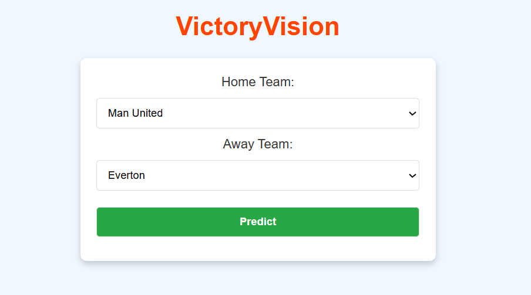
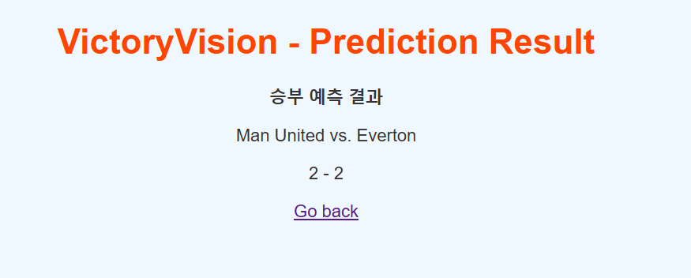

# SoccerMatch_Predictor
An AI-powered web application for predicting soccer match outcomes based on data analysis and machine learning algorithms.
# VictoryVision
**VictoryVision** is a web-based soccer match prediction app that uses machine learning to predict match results based on historical data.

---

## Features
- Predict final scores for soccer matches.
- User-friendly web interface built with Flask.
- Uses Random Forest Regressor for predictions.

---

## How to Run
1. **Install dependencies**:
   ```bash
   pip install -r requirements.txt
   ```
2. **Prepare data**: Run `processing.py` to preprocess soccer data.
3. **Train the model**: 
   ```bash
   python train_save.py
   ```
4. **Start the app**:
   ```bash
   python app.py
   ```
5. **Access**: Open `http://127.0.0.1:5000` in your browser.

---

## Screenshots
### Home Page



### Prediction Result



---

## File Structure
```
VictoryVision/
├── app.py
├── processing.py
├── train_save.py
├── templates/
│   ├── index.html
│   ├── result.html
├── data/
│   ├── train_data.npz
│   ├── test_data.npz
├── result/
│   ├── soccer_model.pkl
│   ├── accuracy.json
```

---

## Acknowledgments
- Dataset: [Football-Data.co.uk](https://www.football-data.co.uk/englandm.php)
